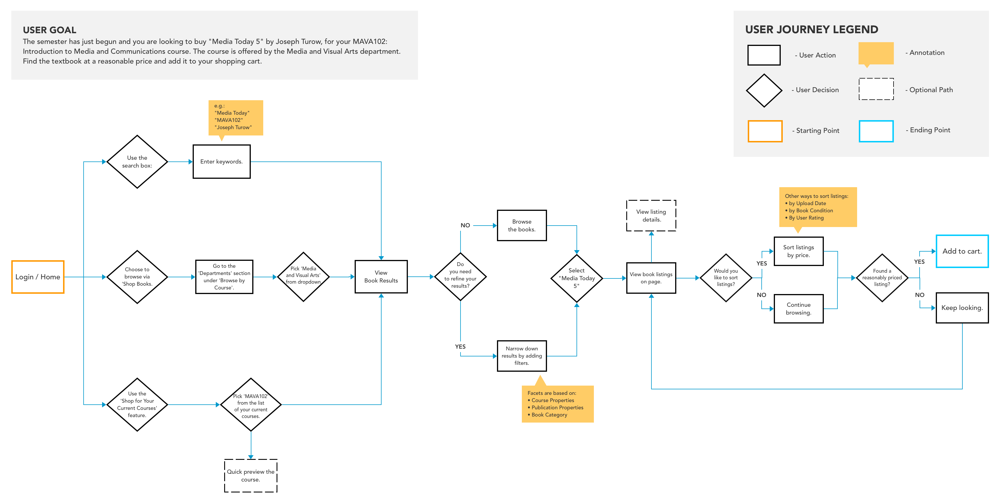
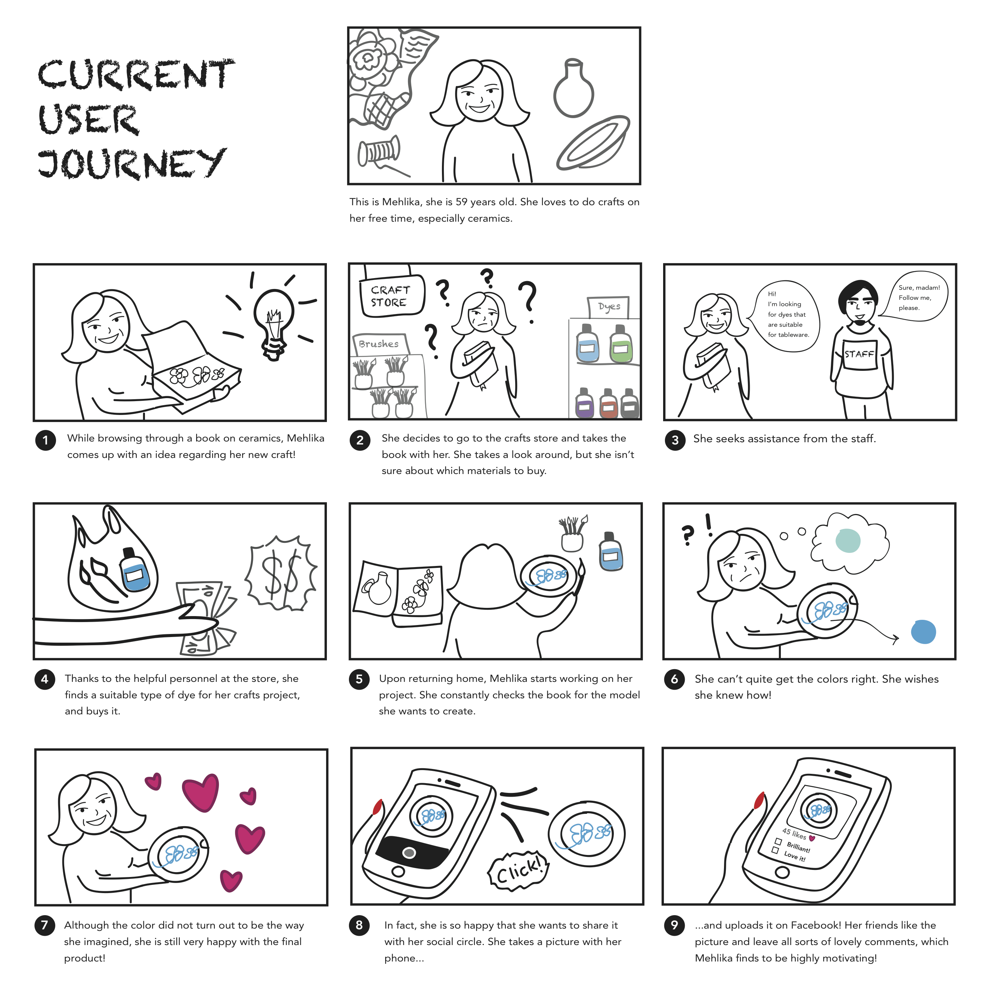
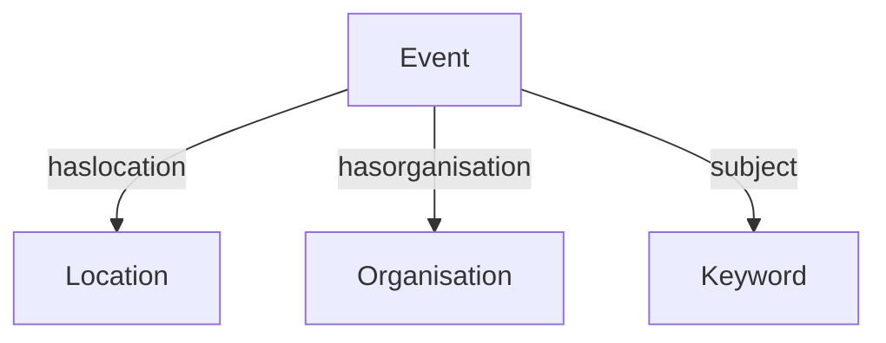

# Lose Your Head - The Client Case

## Informatie Architectuur

Over hoe het structureren en organiseren van informatie op de frontend invloed heeft op de Content modelling van je (headless) CMS, informatie architectuur (IA).

IA helpt de eindgebruiker: die krijgt een website die logisch voelt.
IA helpt jullie: je maakt betere keuzes over data, navigatie en functionaliteit.

### Aanpak

Jullie werken deze sprint aan een project voor een echte opdrachtgever. Elk project heeft een API en jullie bouwen samen een website.  
Vandaag leer je om de informatie in kaart te brengen en te structureren. Dat doen we in een aantal stappen:

1. Wat is informatie architectuur?
2. Sitemap
3. User journey
3. Wireframes
4. Data model

### 1. Wat is informatie architectuur?

Informatie Architectuur gaat over:  
- Welke informatie je laat zien
- Hoe die informatie geordend is
- Hoe gebruikers die informatie terugvinden
- Hoe de informatie technisch aan elkaar gekoppeld is

**🛠️ Opdracht 1 (30 min)**  

Zoek met je team online naar een definitie van Informatie Architectuur. Schrijf in eigen woorden op het whiteboard:
1. Wat is informatie architectuur volgens jullie?
2. Welke vormen van informatie architectuur zijn er, noteer ze en maak er een tekening bij
3. Zoek voorbeelden van sites die deze structuren gebruiken

### 2. Sitemap

Schets een sitemap van de verschillende pagina's van de opdracht die je deze week hebt gekregen (overzicht-, detail-, formulierpagina, etc ...).

*Voorbeeld van een sitemap met paginanummers*

**🛠️ Opdracht 2 (10 min)**

Doe deze oefening op het whiteboard. 

1. Schrijf bovenaan de sitemap de ontwerpvraag van de opdrachtgever.
2. Onderzoek welke pagina's de website moet krijgen. Gebruik de briefing die je hebt gehad, de documentatie en/of het design dat je hebt gekregen.
3. Teken de homepage bovenaan en geef deze pagina nummer 0. Teken daarna alle pagina's die onder de homepage vallen, geef ze een titel en een nummer. Teken daarna de pagina's die een niveau dieper horen en geef ze de nummers 1.1, 1.2, ... of 2.1, 2.2, ... als ze onder pagina 2.0 vallen. Teken een niveau dieper als er nog meer pagina's zijn, pas de nummering aan, trek lijnen, etc ...

### 3. User journey

Wie is jouw eindgebruiker? Wie gaat het project gebruiken? Bedenk wat een doel kan zijn voor de eindgebruiker op jouw website en teken de flow die de eindgebruiker doorloopt om dat te bereiken. Dit kan in een flowchart of schetsend. Kijk eens naar voorbeelden online. 

*Voorbeeld van een user journey dmv een flow chart*

*Voorbeeld van een user journey dmv een schets*

**🛠️ Opdracht 3 (10 min)**

Doe deze oefening op het whiteboard. 

1. Maak één user journey voor jouw eindgebruiker
2. Geef op een duidelijke manier aan wat de stappen zijn

### 4. Wireframes

Teken nette wireframes van de verschillende pagina van de website die je gaat ontwerpen en maken, en bepaal welke data dynamisch moet worden. 

**🛠️ Opdracht 4 (10 min)**  

1. Schets wireframes van de verschillende pagina's. Schets netjes met rechte lijnen, zorg dat elementen de juiste verhoudingen en formaten hebben. Zorg ervoor dat je alle content uitschrijft om een goed beeld te krijgen wat voor informatie op de pagina's getoond gaat worden.
2. Geef aan welke content statisch is en welke dynamisch (wat in de database moet komen).
3. Noteer het organisatie schema en kenmerk van de dynamische informatie (b.v. organisatieschema: alfabetisch, kenmerk: titel)

### 4. Datamodel
Een datamodel laat de logische structuur van een database zien, inclusief de relaties tussen tabellen. Het is belangrijk om dit goed te doorgronden om structuur aan te brengen in je website. Als je nog geen API hebt is dit het begin punt om je Directus database in te stellen. Heb je wel al een API dan helpt een datamodel om grip te krijgen op de data die je kunt gebruiken. 

*Voorbeeld van een datamodel met kolomnamen, datatypes en gerelateerde tabellen*

*Voorbeeld van een relationeel datamodel*

**🛠️ Opdracht 5 (30 min)**

Doe deze oefening op het whiteboard. 

1. Bedenk aan de hand van de wireframes, sitemap en user journey wat voor tabellen jouw project nodig heeft. Let op data die wordt herhaald (zoals de artikelen, schrijver en onderwerpen uit het voorbeeld hierboven).
2. Schets een datamodel; bedenk logische titels voor de tabellen, noteer de kolom naam en de datatypes.
3. Bedenk welke tabelen aan elkaar gerelateerd moeten zijn.
4. Bespreek jullie datamodel met een docent en gebruik het om Directus in te richten.

*Tabel in Directus met kolom namen.*

#### Extra bronnen

- [Directus Data Model](https://docs.directus.io/app/data-model.html)
- [Information architecture: A beginner’s guide](https://www.wix.com/blog/information-architecture)
- [Information Architecture: Study Guide](https://www.nngroup.com/articles/ia-study-guide/)  
- [Mermaid.js documentatie](https://mermaid.js.org/syntax/entityRelationshipDiagram.html)  
- [Student onderzoek naar information architecture](https://blogs.city.ac.uk/sayici-inm452-2016/2017/01/07/inm401-information-architecture-coursework/)

### 💪 Extra uitdagingen

- Maak een conventie voor je datamodel (bijv. dat je het up-to-date houdt als inzichten veranderen) en beschrijf dat in `CONTRIBUTING.md`
- Vergelijk jullie datamodel met het model van andere teams: wat valt je op?
- Maak de sitemap, user journey en datamodel in [mermaid.live](https://mermaid.live/edit) of [PlantUML](https://www.plantuml.com/plantuml) en voeg die toe aan je `README.md`

### ✒️ Leervragen

Zet de antwoorden in je learning journal:
1. Wat is informatie architectuur in je eigen woorden?
2. Welke structuur past het beste bij jouw project en waarom?
3. Hoe helpt een datamodel bij het bouwen van de website?
