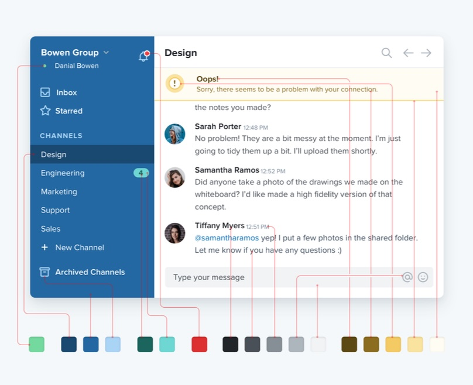
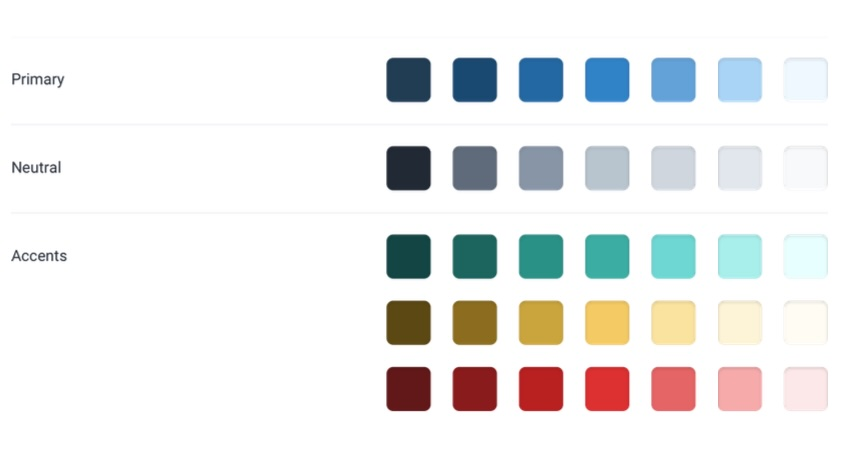
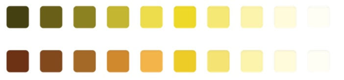
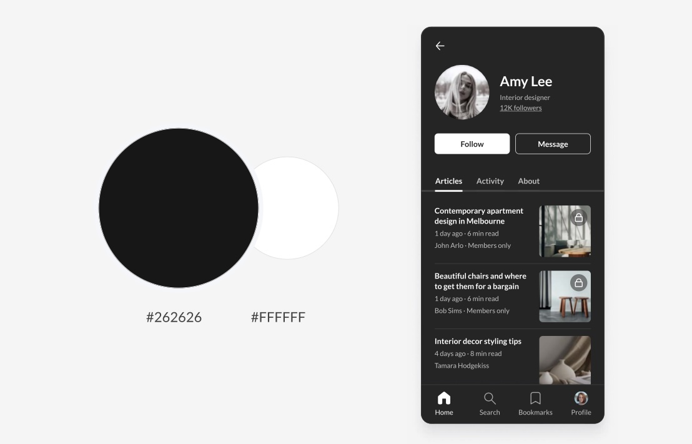
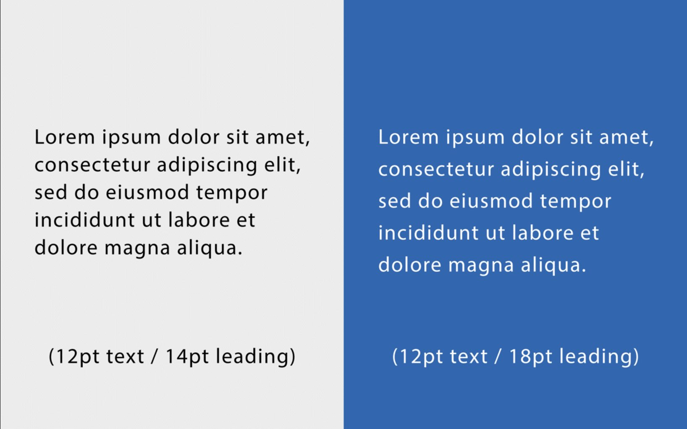
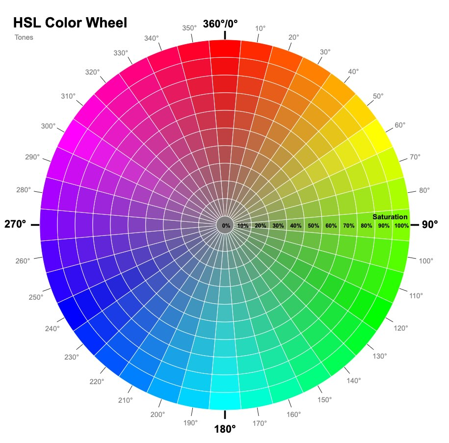
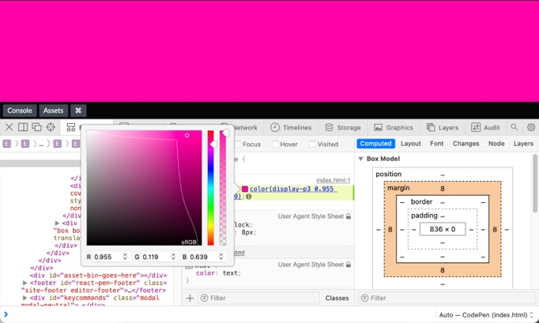
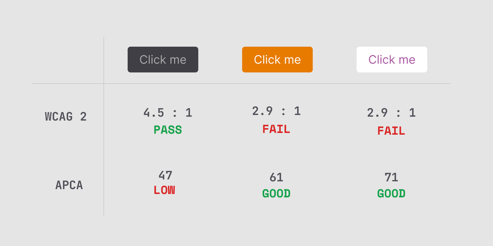

# Lose Your Head - The Client Case

## Styleguide en kleur

Een styleguide is essentieel voor het begrijpen en toepassen van een huisstijl. Een styleguide geeft voorbeelden en uitleg over hoe iets eruit moet zien. Een styleguide helpt bij het ontwerpen en bouwen van een website, zodat de verschillende elementen consistent worden toegepast.

### Aanpak
Voor het maken van een styleguide breng je eerst de verschillende onderdelen van de huisstijl in kaart, zoals typografie, beeldgebruikt, formulierelementen en navigatie. Dit doe je met een _Interface inventory_. Lees in de workshop [styleguide](https://github.com/fdnd-task/look-and-feel-corporate-identity/blob/main/docs/styleguide.md) uit sprint 4 hoe je dat doet

In deze workshop ga je met je team een kleurenpalet samenstellen om te gebruiken voor de styleguide van jouw opdracht. Daarna ga je bedenken hoe je dit slim in code kan opzetten.

## Kleurenpalet
Een kleurenpalet bestaat uit verschillende kleuren die gebruikt kunnen worden in een ontwerp. Als je de kleuren voor een ontwerp goed vastlegt in de styleguide kan je met je team goede afspraken maken en zorg je ervoor dat het ontwerp consistent kan worden toegepast.

In styleguides zie je soms dat een kleurenpalet bestaat uit een paar kleuren. Maar een goed webdesign kan je niet met 5 kleuren maken. er zijn veel meer kleuren nodig voor een goed ontwerp. 
<br>
_Een goed ontwerp heeft veel meer kleuren nodig - [Refactoring UI](https://www.refactoringui.com) van Adam Wathan & Steve Schoger_

### Kleurenpalet samenstellen
Een tip voor een goed bruikbaar kleurenpalet is: bepaal meerdere donkeren en lichte varianten per kleur. Zo kan je in een ontwerp meer kleuren gebruiken dan alleen de volle kleuren.

<br>

Een kleurenpalet bestaat meestal uit een primaire kleur, secundaire kleur (of contrast kleur), accent kleuren en een neutrale kleur voor achtergronden, lijnen, teksten of iconen. Per kleur heb je 5-10 lichtere en donkere varianten nodig waar je uit kan kiezen.

#### Opdracht kleuren bepalen
Alle teamleden maken in Figma dezelfde pagina met verschillende kleuren en/of kleurvariaties. Zorg dat je minimaal 3 verschillende versies hebt.

Bespreek de verschillende versies en stel 1 ontwerp samen op basis van jullie beste ideeen en uitwerkingen. (Bewaar je variaties)

#### Opdracht kleurvariaties bepalen
Maak een overzicht van alle kleuren die jullie in het ontwerp hebben gebruikt.  

Bepaal de primaire kleur, secundaire kleur, accent kleuren en neutrale kleur in `HSL()` waarden in Figma. Maak daarna 3 donkere varianten per kleur, en 3 lichte varianten per kleur. Zo krijg je een kleurenpalet met 7 variaties per kleur.

💡 Je kan donkere en lichte variatie maken door de _lightness_ in `HSL()` te veranderen, maar het kan mooier zijn om de _hue_ aan te passen, zodat je een warme, rijke kleurvariatie krijgt.

<br>
_Soms is het mooier om niet de lightness te veranderen maar de hue aan te passen - [Refactoring UI](https://www.refactoringui.com) van Adam Wathan & Steve Schoge_

#### Opdracht light/darkmode
Ontwerp allemaal een dark-mode versie (of light-mode als je al een donkere versie hebt). Alle teamleden maken in Figma dezelfde pagina met dark-mode kleuren. Zorg dat je minimaal 3 verschillende versies hebt, bespreek de verschillende versies en stel 1 ontwerp samen op basis van jullie beste ideeen en uitwerkingen. (Bewaar je variaties)

💡 Let op dat wit op zwart een te hoog contrast kan hebben. Vooral als een gebruiker het scherm heel fel heeft staan. Probeer eens donker grijs op de achtergrond. En hoe ziet dit eruit met hele licht grijze teksten?

<br>
_Zwart heeft 0% brightness en wit 100%, dit contrast kan onprettig zijn om naar te kijken, heel donker grijs zorgt voor een nette contrast - [Practical UI](https://www.practical-ui.com) van Adham Dannaway_

💡 Let op dat de leesbaarheid van teksten in dark mode kan veranderen. Witte tekst op een donkere achtergrond heeft meer line-height nodig dan donkere tekst op een witte achtergrond. Probeer dit maar eens uit in jullie Figma ontwerp. 



<!-- 
Ik weet deze bron niet meer. Dit is de bijhorende tekst: 

6. Know the connection between color and leading
Contrast and color are extremely important when choosing line heights, and distance between letters. On darker backgrounds, most professional designers will recommend using more leading than on a lighter background. 

Dark colors can add weight to a design, like tight leading. Try to avoid jumping between different leading options from one part of your webpage to the next. 

Using the same amount of leading throughout your page will help to create a sense of balance. Remember, the contrast between your background and text colors should be high to support better readability. Although, if you’re using two colors closer together in shade, a greater amount of leading may improve legibility. 
-->

#### Bronnen

[Refactoring UI](https://www.refactoringui.com) van Adam Wathan & Steve Schoge

[Practical UI](https://www.practical-ui.com) van Adham Dannaway

[6 Mistakes to Avoid in Dark UI Design](https://supercharge.design/articles/6-mistakes-to-avoid-in-dark-ui-design)


## Color in CSS

Er zijn veel verschillende manieren om kleur in CSS te definieren. [CSS named color](https://css-tricks.com/snippets/css/named-colors-and-hex-equivalents/), [Hex](https://developer.mozilla.org/en-US/docs/Web/CSS/hex-color), [RGB](https://developer.mozilla.org/en-US/docs/Web/CSS/color_value/rgb), [HSL](https://developer.mozilla.org/en-US/docs/Web/CSS/color_value/hsl), om er maar een paar te noemen.

Sinds [CSS Color Module Level 4](https://www.w3.org/TR/css-color-4/) is de syntax voor kleurendefinitie veranderd. Er zijn bijvoorbeeld geen komma's meer nodig voor rgb() en hsl() `color: hsl(180deg, 100%, 50%)` kan nu zo: `color: hsl(180deg 100% 50%)`. Dit wordt ondersteund door een goede baseline van moderne browsers. Maar wat betekent dat eigenlijk voor oude browsers?

Hieronder krijg je een aantal tips en vragen voor kleur in CSS. Dit kan je gebruiken voor de code afspraken die jullie gaan maken voor de styleguide van jullie opdracht. 

### HSL()

Een meer intuitieve manier van kleur definieren is met `hsl()`, in plaats van rgb waardes wordt een kleur gedefinieerd door de _hue_, _saturation_ en _lightness_.  

<br>
_[HSL color wheel Codepen](https://codepen.io/websanity/pres/QWNMRq) van WebSanity_

`hsl()` geeft niet alleen een meer gevoelsmatige manier van kleuren definieren. Het zorgt er ook voor dat je met behulp van custom properties verschillende states van een button kan coderen. 

```css
button {
  --h: 100; 
  --s: 50%; 
  --l: 50%; 
  --a: 1; 
  background: hsl(var(--h) var(--s) var(--l) / var(--a)); 
  
  &:hover {
    --l: 75%;  /* Change lightness */ 
  }
  
  &:focus, &:active  {  
    --s: 75%;  /* Change saturation */ 
  }
  
  &[disabled] {   
    --s: 0%; /* Make look disabled */
    --a: 0.5; 
  }
}
```

💡 Dit is een interessant artikel van Sara Soueidan over waarom zij `hsl()` is gaan  gebruiken: 
[On Switching from HEX & RGB to HSL](https://www.sarasoueidan.com/blog/hex-rgb-to-hsl/)


### New CSS Color Functions
Sinds een paar jaar zijn er meer manieren om kleuren te definineren bijgekomen. Zoals `lab()` en `lch()`. Niet alleen zijn het andere manieren om kleuren te definieren, hiermee kan je ook meer kleuren laten zien dan met `rgb()` en `hsl()`.


💡 Lees meer over deze Color Functions op Smashing magazine: https://www.smashingmagazine.com/2021/11/guide-modern-css-colors/

Omdat schermen steeds beter worden en meer kleuren kunnen laten zien zijn er nieuwe 'color spaces' bedacht zoals `Display-P3`. Als een gebruiker een modern scherm heeft dan kan je een veel mooiere, heldere en fellere kleuren tonen. 

<br>
_het kleurenspectrum van Display-P3 is een stuk groter dan van rgb_

💡 Lees meer over New CSS Color Features op CSS Tricks, met uitleg en code voorbeelden: https://css-tricks.com/new-css-color-features-preview/

Kan jouw scherm deze kleuren laten zien? Hoe zit het met browser ondersteuning? Hoe zou je dit kunnen gebruiken voor jullie opdracht?


### light-dark() color function

Met de `light-dark()` color function kan je met een shorthand twee kleuren bepalen die worden getoond als een _light_ of _dark_ mode aan staat ingesteld. 

```css
:root {
  color-scheme: light dark;
}
body {
  color: light-dark(#333b3c, #efefec);
  background-color: light-dark(#efedea, #223a2c);
}
```

Probeer het zelf: https://developer.mozilla.org/en-US/docs/Web/CSS/color_value/light-dark


<!--
### Relative color syntax

https://frontendmasters.com/blog/relative-color-syntax-basic-use-cases/
-->

### WCAG 3

In WCAG 3 komt een nieuwe manier van om te meten of teksten goed leesbaar zijn op een achtergondkleur.  APCA (Advanced Perceptual Contrast Algorithm). De methode kijkt verder dan licht-donker contrast en houdt rekening met hoe mensen contrast daadwerkelijk ervaren.

<br>
_Hier kan je de verschillen zien tussen WCAG2 en ACPA contrast test_

💡 Vind je dit interessant en wil je er meer over lezen? Lees hier wat je hiermee kan doen: 
https://rox.nl/blog/apca-vervangt-wcag2-contrast

<!-- https://typefully.com/DanHollick/wcag-3-and-apca-sle13GMW2Brp -->


### Fallback
CSS is constant in ontwikkeling. Er zijn hele vette kleuren technieken bijgekomen, de notaties veranderen, browsers veranderen ... wat betekent dat voor de toegankelijkheid? Hoe bouw je robuste CSS én omarm je de veranderingen?

Zo is het bijvoorbeeld niet meer nodig om kommas te gebruiken in rgb() en hsl() functies. En sinds een jaar ondersteuenen alle grote moderen browsers dit. Maar niet iederen heeft een moderne browser. De meeste mensen weten niet eens wat die zin betekent ... 

Bedenk een CSS strategie waarmee je de nieuwe kleurenschema's en ontwikkelingen kan gebruiken, terwijl de moeder van Koop nog steeds de website goed genoeg kan gebruiken.